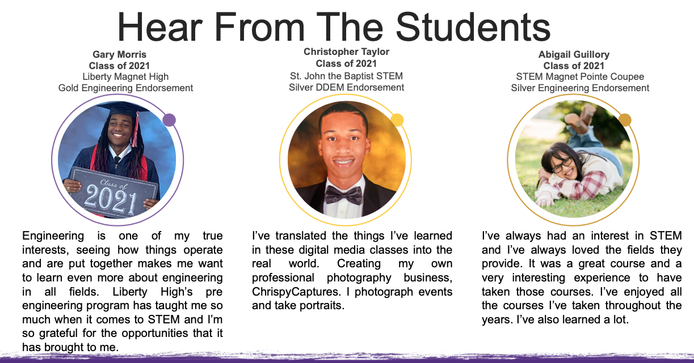

---
# An instance of the Portfolio widget.
# Documentation: https://wowchemy.com/docs/page-builder/
widget: blank
active: true
# header:
#   image: "header.jpg"
# This file represents a page section.
headless: true

# Order that this section appears on the page.
weight: 66

# title: Projects
# subtitle: ''

# content:
#   # Page type to display. E.g. project.
# page_type: project

#   # Default filter index (e.g. 0 corresponds to the first `filter_button` instance below).
#   filter_default: 0

design:
  # Choose how many columns the section has. Valid values: '1' or '2'.
  columns: '1'

  # Toggle between the various page layout types.
  #   1 = List
  #   2 = Compact
  #   3 = Card
  #   5 = Showcase
  #view: 3

  # For Showcase view, flip alternate rows?
  # flip_alt_rows: true
---

## **STEM Endorsements and Student Success**
## Many of the students who study with LSU STEM Pathways graduate with a gold or silver seal STEM endorsement on their diplomas. 
 
<!-- <a href="../../brochures/Slide-Overview.pdf" target="_blank"><button style= "background-color:#fdd023; border: none ; border-radius: 5px; padding: 12px">STEM endorsement brochure</button></a> <a href="../../brochures/Slide-StudentSuccess.pdf" target="_blank"><button style= "background-color:#fdd023; border: none ; border-radius: 5px; padding: 12px"> Student testimonials </button></a> 
 
 
 <a href= "https://docs.google.com/document/d/1g8RYhqWd9l_4GDjLWNSU4tYbFlQQw94iAKDOJi7IvgQ">STEM endorsement brochure accessible version</a> 
 
<a href= "https://docs.google.com/document/d/1nPAGbyEaz5yWh-BcBaJWiCmCeD6sZx68KlNpdRuEON4">Student testimonials accessible version</a> 
 
  -->

## Where are they now?
Check out this article which follows up on two students who earned the Gold STEM Endorsement and were awarded the LSU Pre-Engineering Gold STEM Seal scholarship to pursue a degree in engineering.
 
 
<a href="https://www.lsu.edu/eng/news/2023/02/pathwaysgoldscholarship.php" target="_blank"><button style= "background-color:#fdd023; border: none ; border-radius: 5px; padding: 12px">LSU Pathways Offers Students Gold Scholarship</button></a>
 
 
The LSU Cain Center is happy to announce that this year we awarded 3 Gold STEM Seal Scholarships, valued at $1500 each, and 3 Silver scholarships, valued at $750 each, to incoming LSU freshmen in the class of 2023. 
 
 
<a href="https://capitalareastem.org/news/blog.html/article/2023/11/08/celebrating-excellence-lsu-stem-pathways-gold-and-silver-stem-seal-scholarship-recipients" target="_blank"><button style= "background-color:#fdd023; border: none ; border-radius: 5px; padding: 12px">Gold and Silver STEM Seal Scholarship Recipients</button></a>
 
 

 

## **Student Endorsements by Academic Year**
 

## 2022-2023
418 students graduated with STEM endorsements from LSU Pathways.
 
<!--  
<a href="https://endorsements.lsupathways.com/#2023-endorsements" target="_blank"><button style= "background-color:#fdd023; border: none ; border-radius: 5px; padding: 12px">2023 Graduates</button></a> -->


- Benjamin Franklin High School
- Central High School
- College and Careers Center
- Delhi Charter School
- Denham Springs High School STEM and Robotics Center
- Haynes Academy School for Advanced Study
- Liberty High School
- MSA East
- Pointe Coupee SMA
- St. John the Baptist SMA
- Woodlawn High School


 

## 2021-2022
151 students graduated with STEM endorsements from LSU Pathways.
 
<!--  
<a href="https://endorsements.lsupathways.com/#2022-endorsements" target="_blank"><button style= "background-color:#fdd023; border: none ; border-radius: 5px; padding: 12px">2022 Graduates</button></a> -->


- Benjamin Franklin High School
- Central High School
- Denham Springs High School STEM and Robotics Center
- Haynes Academy School for Advanced Studies
- Liberty Magnet High School
- Rapides Career and Technical Education Program
- STEM Magnet Academy of Point Coupee 
- St. James College and Career Readiness
- St. Martinville Senior High School

 

## 2019-2020
23 students graduated with STEM endorsements from LSU Pathways. 
  
<a href="https://www.louisianabelieves.com/docs/default-source/academics/2020-stem-endorsement-graduates.pdf?sfvrsn=85e9981f_2" target="_blank"><button style= "background-color:#fdd023; border: none ; border-radius: 5px; padding: 12px">2020 Graduates</button></a>
 


- Liberty Magnet High School
- STEM Magnet Academy of Point Coupee


