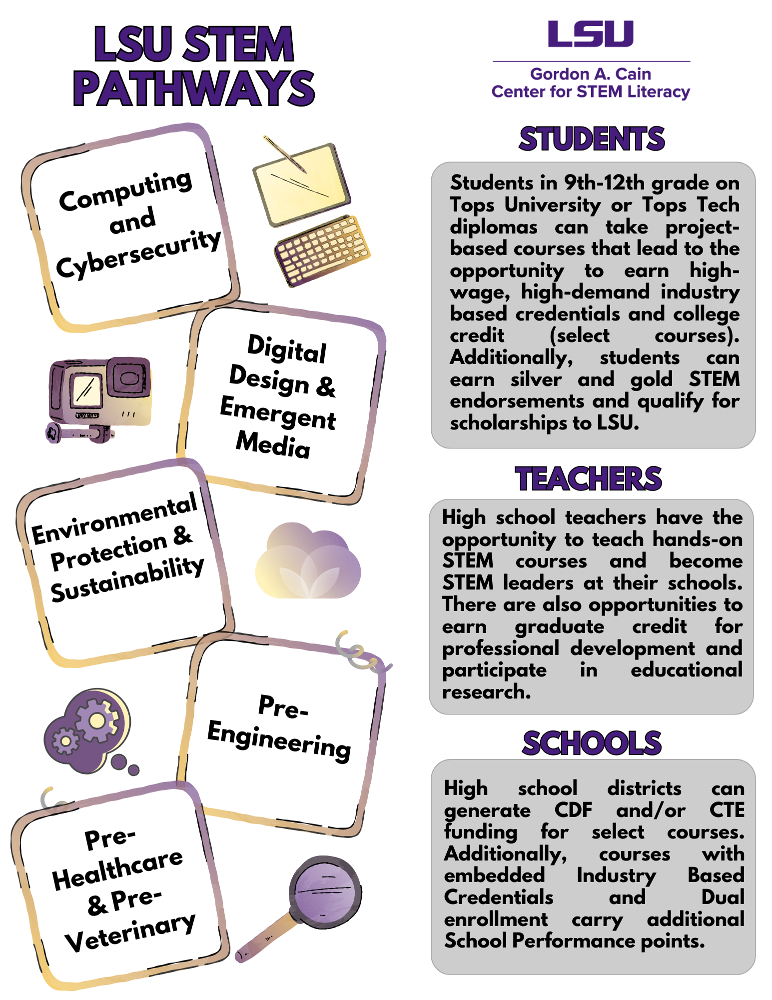

---
# An instance of the Portfolio widget.
# Documentation: https://wowchemy.com/docs/page-builder/
widget: blank
active: true
# header:
#   image: "header.jpg"
# This file represents a page section.
headless: true

# Order that this section appears on the page.
weight: 66

# title: Projects
# subtitle: ''

# content:
#   # Page type to display. E.g. project.
# page_type: project

#   # Default filter index (e.g. 0 corresponds to the first `filter_button` instance below).
#   filter_default: 0

design:
  # Choose how many columns the section has. Valid values: '1' or '2'.
  columns: '1'

  # Toggle between the various page layout types.
  #   1 = List
  #   2 = Compact
  #   3 = Card
  #   5 = Showcase
  #view: 3

  # For Showcase view, flip alternate rows?
  # flip_alt_rows: true
---

## **Interested in getting involved?**
## If you are a student, parent, teacher, or school administrator and are interested in getting involved with the LSU Pathways, please see below for more information.

<iframe src="https://www.youtube.com/embed/BtUjV6w8g8Q?si=mM2TleVWr0OM3-m6&amp;autoplay=1&mute=1" width="560" height="315" frameborder="0" allowfullscreen></iframe>

 

## For Teachers
 
In order to teach an LSU Pathway course or module, no prior STEM experience is assumed. A teacher simply needs STEM-curiosity, enthusiasm for project-based teaching, and willingness to attend a virtual summer training workshop. Throughout the school year, teachers receive continual assistance from, and access to, LSU STEM Pathways’ support staff. To learn more about teaching with each pathway, click a link to view the flyer.
 
 

<a href="../../brochures/pathways-infographic.pdf" target="_blank"><button style= "background-color:#fdd023; border: none ; border-radius: 5px; padding: 12px"> High School</button></a> <a href="../../brochures/MiddleSchoolFlyer.pdf" target="_blank"><button style= "background-color:#fdd023; border: none ; border-radius: 5px; padding: 12px"> Middle School</button></a> <a href="../../brochures/ElementaryBrochure.pdf" target="_blank"> <button style= "background-color:#fdd023; border: none ; border-radius: 5px; padding: 12px"> Elementary School</button></a> <a href="../../brochures/Testimonials.pdf" target="_blank"> <button style= "background-color:#fdd023; border: none ; border-radius: 5px; padding: 12px"> Teacher Testimonials</button></a> <a href="../../brochures/Spotlights.pdf" target="_blank"> <button style= "background-color:#fdd023; border: none ; border-radius: 5px; padding: 12px"> Faculty Spolights</button></a>
 
 
 
<iframe src="https://www.youtube.com/embed/mOPWnP5QDjw?si=iGeg1gMNfNGXB1bz&amp;autoplay=1&mute=1" width="560" height="315" frameborder="0" allowfullscreen></iframe>

 
 
<a href= "https://docs.google.com/document/d/1IMYCa6P8DXuFtnofiAM4iIiO-RQLMtvonZaawV3beqA">High school flyer accessible version</a> 
 
<a href= "https://docs.google.com/document/d/1OY13kOd3rVUH-l4U4T5Eg498KSkuOxCGKkoyNNDeS8Q">Middle school flyer accessible version</a> 
 
 <a href= "https://docs.google.com/document/d/1Js2pbHcEEfbH70zmD8ItHugH1TmboWNpKEF8EibzMic">Elementary school flyer accessible version</a> 
 
 <a href="https://docs.google.com/document/d/1xSkhScopz61YqVoay-tMOYEr7fFw2thKiQI7TkGqB6Q">Teacher testimonials accessible version</a>
 
 

## For School Administrators
 

 

Formal registration and course-specific training dates for the 2025-26 LSU STEM Pathways will be available mid-March. In the meantime, please review our current course catalog and our invitation to participate. If you are interested in participating in 2025-26 and would like to receive more information, please complete the request for information. For any questions, please email <a href="mailto:stempathways@lsu.edu">stempathways@lsu.edu</a>.
 
 
<a href="https://lsu.formstack.com/forms/caincenter_interest_form" target="_blank"><button style= "background-color:#fdd023; border: none ; border-radius: 5px; padding: 12px"> Request Information or MOU</button></a> <a href="https://docs.google.com/document/d/1QqsUGYCeUTkjkRMGLlsf_fwB9pz9NJf9XhHrXYChm-o/edit" target="_blank"><button style= "background-color:#fdd023; border: none ; border-radius: 5px; padding: 12px">Course Catalog </button></a> <a href="https://drive.google.com/file/d/1UWloqX4FzPLiXOzNWgMJZRUEPcbkUrQD/view?usp=drive_link" target="_blank"><button style= "background-color:#fdd023; border: none ; border-radius: 5px; padding: 12px">Pathways Invitation </button></a> <a href="https://docs.google.com/document/d/1uqd_MRA22vHTRycKSePGmq8QqCcBUFHT9pcMv1zElos/edit#heading=h.evbbp36i1a94" target="_blank"><button style= "background-color:#fdd023; border: none ; border-radius: 5px; padding: 12px"> Training Guide </button></a>
 
 
<a href= "https://docs.google.com/document/d/1gQH6QP-7Np5DQfmJx0_6L894jLEPAUI-mjZBzXfnzIw/edit?tab=t.0#heading=h.qss2sjj8h4cy"> Course catalog accessible version</a>
 
<a href= "https://docs.google.com/document/d/1N9lvRMcrCJ_dv9aWMsyeWZfA6YoJAYtumrTEaCxOpUM/edit?tab=t.0"> Training dates and times accessible version</a>
 
<a href= "https://docs.google.com/document/d/1jb7_I6f5YTEj56SzMCzQTQDjEhL2k9UracDGATscILQ/edit?tab=t.0#heading=h.uynxpnqstem">LSU Pathways invitation accessible version</a>

 

 

 

### How to start or expand an LSU STEM Pathway at your school:
1. Get district and school administrative buy-in
2. Consider developing a K-12 district-wide framework to support your high school STEM Pathway
3. School completes the LSU STEM Pathways Memorandum of Understanding (MOU)
4. Teachers attend virtual LSU Pathways training in June/July
5. Students earn certifications during the school year with ongoing support from LSU

 