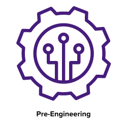

## **LSU STEM Pathways in the News**

 
<iframe width="450" height="250" src="https://www.youtube.com/embed/PGGFH_2nUsA" title="YouTube video player" frameborder="0" allow="accelerometer; autoplay; clipboard-write; encrypted-media; gyroscope; picture-in-picture" allowfullscreen></iframe> <iframe width="450" height="250" src="https://www.youtube.com/embed/yluym2wWOk0" title="YouTube video player" frameborder="0" allow="accelerometer; autoplay; clipboard-write; encrypted-media; gyroscope; picture-in-picture" allowfullscreen></iframe>
 
 
<a href="https://www.theadvocate.com/baton_rouge/news/communities/livingston_tangipahoa/article_140b2d96-fc56-11eb-a23e-f705caf80b8c.html" target="_blank"><button style= "background-color:#fdd023; border: none ; border-radius: 5px; padding: 12px">Pathways in the Advocate </button></a>  <a href="https://www.louisianabelieves.com/courses/all-things-jump-start" target="_blank"><button style= "background-color:#fdd023; border: none ; border-radius: 5px; padding: 12px"> Read about Jump Start on louisianabelieves.com </button></a> 
 
 
 

Check out this article which follows up on two students who earned the Gold STEM Endorsement and were awarded the LSU Pre-Engineering Gold STEM Seal scholarship to pursue a degree in engineering.
 
 
<a href="https://www.lsu.edu/eng/news/2023/02/pathwaysgoldscholarship.php" target="_blank"><button style= "background-color:#fdd023; border: none ; border-radius: 5px; padding: 12px">LSU Pathways Offers Students Gold Scholarship</button></a>
 
 
The LSU Cain Center is happy to announce that this year we awarded 3 Gold STEM Seal Scholarships, valued at $1500 each, and 3 Silver scholarships, valued at $750 each, to incoming LSU freshmen in the class of 2023. 
 
 
<a href="https://capitalareastem.org/news/blog.html/article/2023/11/08/celebrating-excellence-lsu-stem-pathways-gold-and-silver-stem-seal-scholarship-recipients" target="_blank"><button style= "background-color:#fdd023; border: none ; border-radius: 5px; padding: 12px">Gold and Silver STEM Seal Scholarship Recipients</button></a>
 
 
 

## **LSU STEM Pathways Curriculum Media**

## Overview and Highlights
 
<a href="../media-highschool" target="_blank"><button style= "background-color:#fdd023; border: none ; border-radius: 5px; padding: 12px"> High School</button></a> <a href="../media-middleschool" target="_blank"><button style= "background-color:#fdd023; border: none ; border-radius: 5px; padding: 12px"> Middle School</button></a> <a href="../media-elementaryschool" target="_blank"><button style= "background-color:#fdd023; border: none ; border-radius: 5px; padding: 12px"> Elementary School</button></a> 
 
 

## High School Pathways Curriculum Videos
 
 <table>
  <tr> 
    <td style="border: 0;"></td>
    <td style="border: 0;"></td>
    <td style="border: 0;"> </td>
    <td style="border: 0;"></td>
  </tr>
</table>